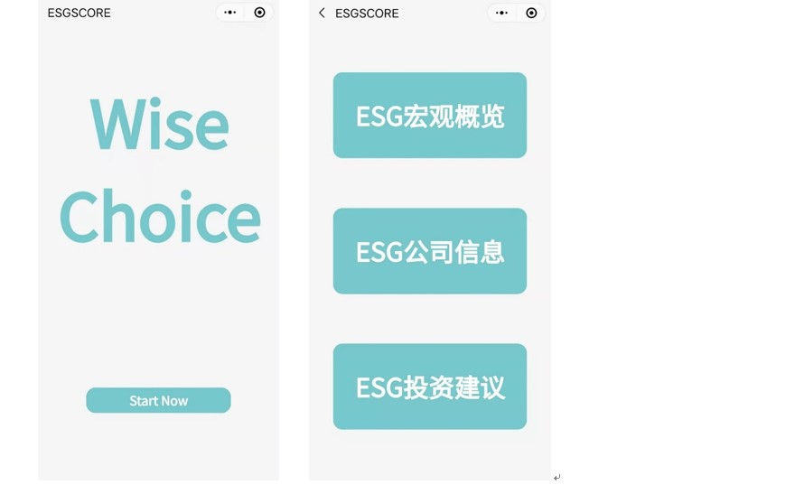
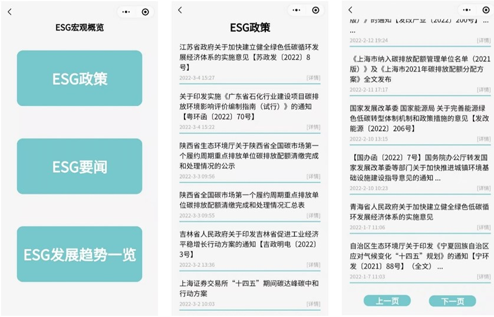
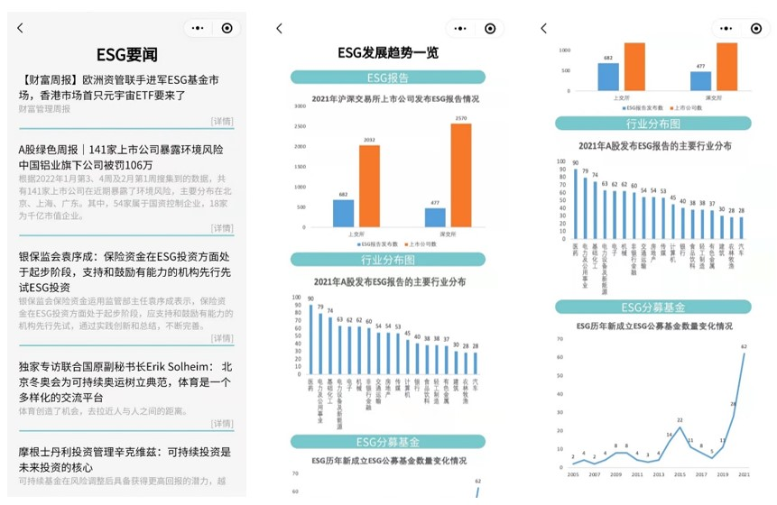
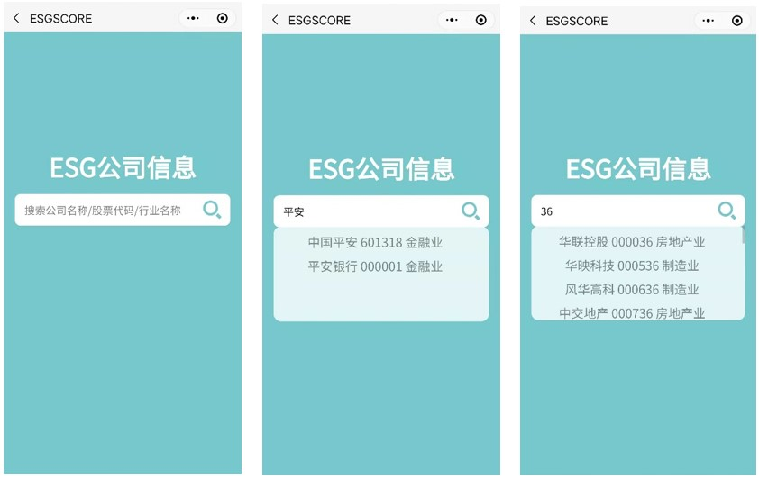
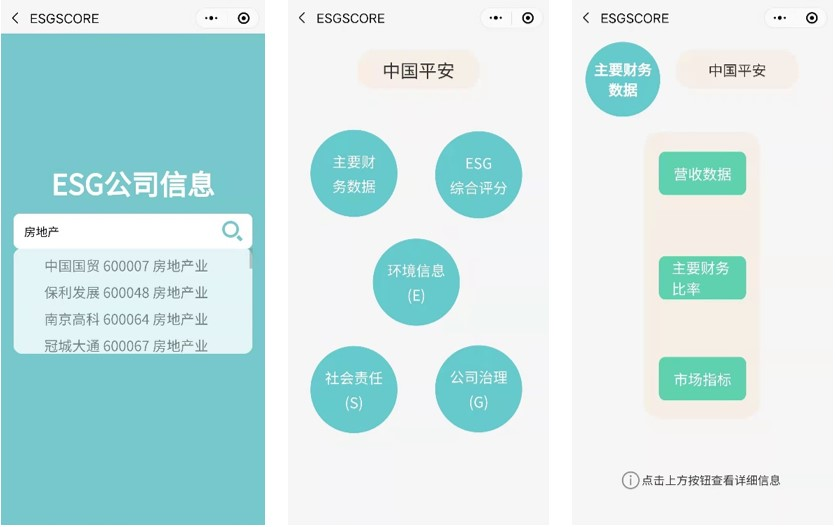
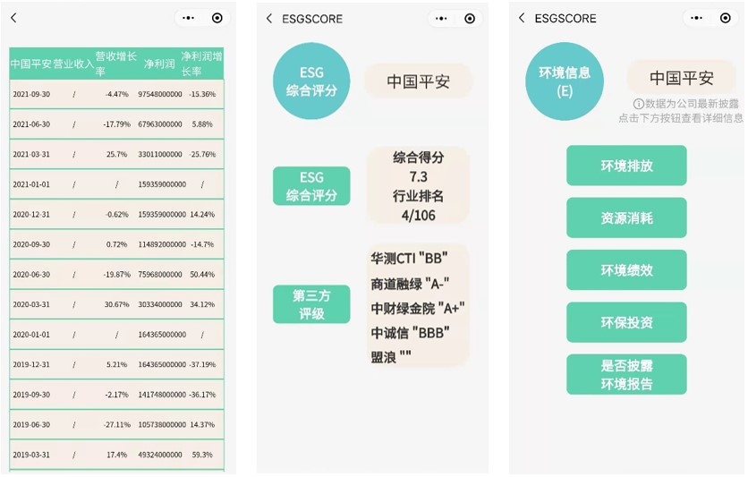
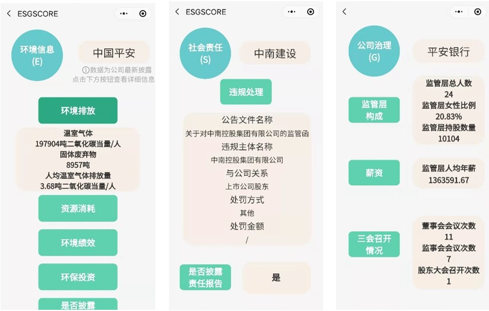
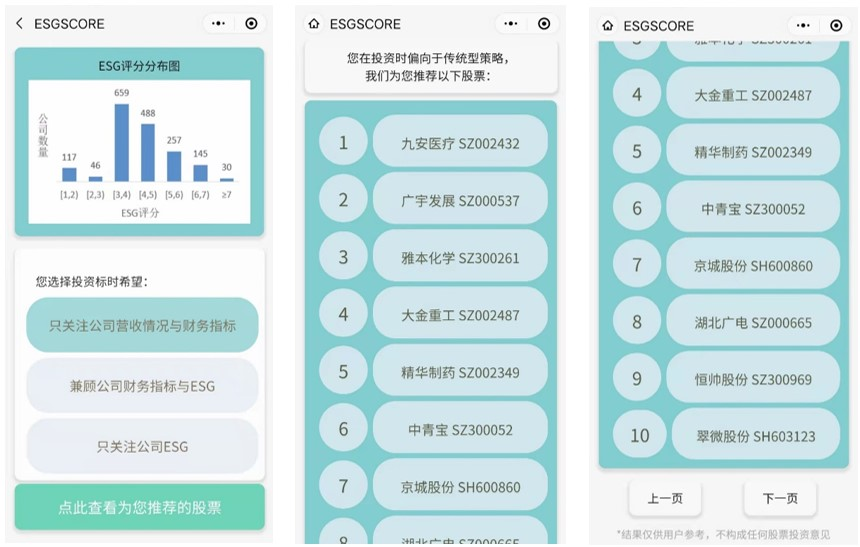

# ESGSCORE小程序

### 若图片无法查看，请移步博客：
[小程序项目：ESGSCORE](https://blog.csdn.net/qq_55872579/article/details/126592281?csdn_share_tail=%7B%22type%22%3A%22blog%22%2C%22rType%22%3A%22article%22%2C%22rId%22%3A%22126592281%22%2C%22source%22%3A%22qq_55872579%22%7D)

本项目旨在以微信小程序的方式为客户提供直观、科学整合、可比性高及个性化的ESG信息和ESG投资建议。本项目兼顾财务与非财务指标，以客户个人偏好为基础提供最优投资建议，此外，项目运用科学的模型与算法整合市场上现有ESG相关数据信息，提供更加一致化的ESG评分。

- 对宏观ESG政策、新闻、发展情况的整合筛选与定期更新，向客户展示更加直观清晰的ESG发展版图；
- 整合各评级机构对部分A股企业的ESG评分，以更加直观及个性化的方式呈现给客户，使得海量信息更加集中和规范；
- 根据投资者的个人喜好，提供ESG数据、财务数据、ESG与财务数据三个选项，平衡财务数据与非财务数据，通过因子模型向投资者推荐相关ESG优质股票，兼顾科学性与投资者偏好。

## 界面展示

### (1)主页面
设置三个模块按钮，分别是“ESG宏观概览”、“ESG公司信息”、“ESG投资建议”，用户点击即可进入不同模块的展示。

### (2)ESG宏观概览
- 设有“ESG政策”页面，页面以时间顺序展现有关于ESG的政策，每页展示20条数据，点击每条数据可以跳转外部链接进入政策详情。
- “ESG要闻”与“ESG政策”功能相似。
- “ESG发展趋势一览”主要为用户展现ESG报告、行业分布图及ESG公募基金数据图，帮助用户从宏观层面了解ESG的发展趋势。
  

### (3)ESG公司信息
- 设置搜索栏，用户可以搜索公司名称/股票代码/行业名称，进入公司信息/行业展示页面。
- 设置行业展示，用户可以浏览行业信息。
- 设置公司信息概览，用户可以查看具体公司的主要财务数据、ESG综合评分、环境信息、社会责任、公司治理。
  

### (4)ESG投资建议
- 展示ESG分布图，用户可以直观了解不同ESG评分区间的公司数量分布。
- 设置偏好选项，用户可以选择自己偏向的投资策略。
- 推荐股票，系统根据用户偏好，推荐相应股票。
- 查看推荐的股票对应公司的ESG信息，用户在浏览推荐股票时，可以点击股票名称查看对应公司的ESG信息。

